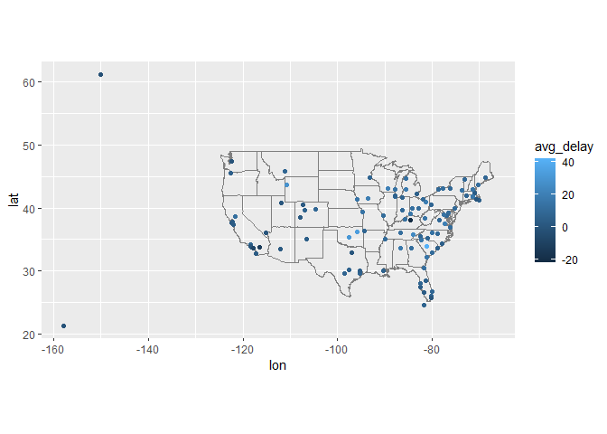

Homework 3
================
Justin Li
2022-10-16

## Questions from 13.4.6

1.  Compute the average delay by destination, then join on the airports
    data frame so you can show the spatial distribution of delays.

``` r
flights %>%
  group_by(dest) %>%
  summarise(avg_delay = mean(arr_delay, na.rm = T)) %>%
  left_join(airports, c("dest" = "faa")) %>%
  ggplot(aes(lon, lat, color = avg_delay)) +
    borders("state") +
    geom_point() +
    coord_quickmap()
```

<!-- -->

2.  Add the location of the origin and destination (i.e. the lat and
    lon) to flights.

``` r
flights %>%
  left_join(airports, c("dest" = "faa")) %>%
  left_join(airports, c("origin" = "faa")) %>%
  summarise(origin, name.y, lat.y, lon.y, dest, name.x, lat.x, lon.x)
```

    ## # A tibble: 336,776 × 8
    ##    origin name.y              lat.y lon.y dest  name.x               lat.x lon.x
    ##    <chr>  <chr>               <dbl> <dbl> <chr> <chr>                <dbl> <dbl>
    ##  1 EWR    Newark Liberty Intl  40.7 -74.2 IAH   George Bush Interco…  30.0 -95.3
    ##  2 LGA    La Guardia           40.8 -73.9 IAH   George Bush Interco…  30.0 -95.3
    ##  3 JFK    John F Kennedy Intl  40.6 -73.8 MIA   Miami Intl            25.8 -80.3
    ##  4 JFK    John F Kennedy Intl  40.6 -73.8 BQN   <NA>                  NA    NA  
    ##  5 LGA    La Guardia           40.8 -73.9 ATL   Hartsfield Jackson …  33.6 -84.4
    ##  6 EWR    Newark Liberty Intl  40.7 -74.2 ORD   Chicago Ohare Intl    42.0 -87.9
    ##  7 EWR    Newark Liberty Intl  40.7 -74.2 FLL   Fort Lauderdale Hol…  26.1 -80.2
    ##  8 LGA    La Guardia           40.8 -73.9 IAD   Washington Dulles I…  38.9 -77.5
    ##  9 JFK    John F Kennedy Intl  40.6 -73.8 MCO   Orlando Intl          28.4 -81.3
    ## 10 LGA    La Guardia           40.8 -73.9 ORD   Chicago Ohare Intl    42.0 -87.9
    ## # … with 336,766 more rows

3.  Is there a relationship between the age of a plane and its delays?

``` r
flights %>%
  left_join(planes, by="tailnum") %>%
  mutate(age = year.x - year.y) %>%
  group_by(age) %>%
  summarise(avg_delay = mean(arr_delay, na.rm = T)) %>%
  ggplot(aes(age, avg_delay)) + geom_point()
```

<!-- -->

There seems to be no relationship between the age of a plane and its
delays because the points are spread out across all ages groups.
